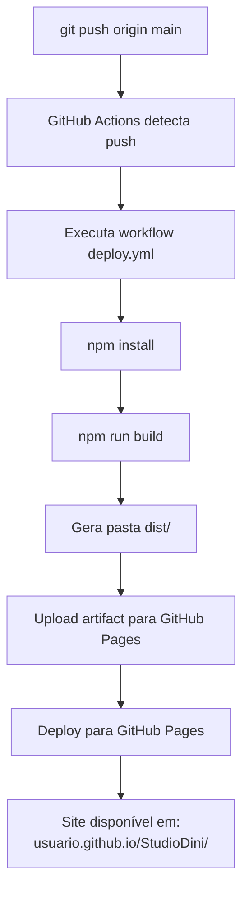

# 📂 Estrutura Final do Projeto - GitHub Pages Ready

## ✅ Estrutura Completa e Corrigida

```
StudioDini/
│
├── 📄 ARQUIVOS DE CONFIGURAÇÃO (ESSENCIAIS)
│   ├── index.html                      ✅ HTML base
│   ├── main.tsx                        ✅ Entry point React
│   ├── App.tsx                         ✅ Router principal (HashRouter)
│   ├── vite.config.ts                  ✅ Config Vite (base: '/StudioDini/')
│   ├── package.json                    ✅ Dependências e scripts
│   ├── tsconfig.json                   ✅ Config TypeScript
│   ├── tsconfig.node.json              ✅ Config TypeScript Node
│   └── vercel.json                     ⚠️  Apenas para Vercel (ignore para GH Pages)
│
├── 📁 .github/                         ✅ GitHub Actions
│   └── workflows/
│       └── deploy.yml                  ✅ Workflow de deploy automático
│
├── 📁 public/                          ✅ Assets estáticos
│   ├── .nojekyll                       ✅ Desabilita Jekyll
│   └── .gitkeep                        ✅ Mantém pasta no git
│
├── 📁 components/                      ✅ Componentes React
│   ├── HomePage.tsx                    ✅ Página inicial (Hero + Portfólio)
│   ├── AboutPage.tsx                   ✅ Página sobre
│   ├── ServicesPage.tsx                ✅ Página de serviços
│   ├── PortfolioPage.tsx               ✅ Página de portfólio
│   ├── ContactPage.tsx                 ✅ Página de contato
│   ├── NotFoundPage.tsx                ✅ Página 404
│   ├── Navbar.tsx                      ✅ Menu de navegação
│   ├── Footer.tsx                      ✅ Rodapé
│   ├── StudioDiniLogo.tsx              ✅ Logo SVG
│   │
│   ├── figma/                          ✅ Componentes Figma
│   │   └── ImageWithFallback.tsx       ✅ Imagem com fallback
│   │
│   └── ui/                             ✅ Componentes UI (shadcn)
│       ├── accordion.tsx
│       ├── alert.tsx
│       ├── button.tsx
│       ├── card.tsx
│       └── ... (50+ componentes)
│
├── 📁 styles/                          ✅ Estilos
│   └── globals.css                     ✅ CSS global + Tailwind
│                                          (Cor #E9BB38 configurada)
│
├── 📁 guidelines/                      ℹ️  Documentação interna
│   └── Guidelines.md                   ℹ️  Guia de desenvolvimento
│
├── 📄 DOCUMENTAÇÃO DE DEPLOY           ✅ Guias criados
│   ├── LEIA_PRIMEIRO.md                ⭐ COMECE AQUI - Guia rápido
│   ├── INICIO_RAPIDO.txt               ⭐ Comandos rápidos (ASCII)
│   ├── DEPLOY_GITHUB_PAGES.md          📘 Guia rápido (3 passos)
│   ├── GITHUB_PAGES_SETUP.md           📗 Guia completo + detalhes
│   ├── PRE_DEPLOY_CHECKLIST.md         ✅ Checklist de validação
│   ├── RESUMO_CORREÇÕES.md             📊 O que foi corrigido
│   ├── TROUBLESHOOTING.md              🔧 Solução de problemas
│   ├── ESTRUTURA_FINAL.md              📂 Este arquivo
│   ├── DEPLOY_INSTRUCTIONS.md          📄 Instruções gerais
│   └── README.md                       📖 README principal
│
├── 📄 SCRIPTS E UTILIDADES
│   ├── build-for-github-pages.sh       🔨 Script de build
│   ├── .gitignore                      🚫 Arquivos ignorados
│   └── .npmrc                          ⚙️  Config npm
│
└── 📄 OUTROS
    └── Attributions.md                 ℹ️  Atribuições de recursos
```

---

## 🔑 Arquivos Críticos para GitHub Pages

### ⭐ ESSENCIAIS (Sem eles o site não funciona)

1. **vite.config.ts**
```typescript
base: '/StudioDini/',  // ← DEVE ter isto!
```

2. **App.tsx**
```typescript
import { HashRouter } from "react-router-dom";  // ← HashRouter, NÃO BrowserRouter!
```

3. **public/.nojekyll**
```
Arquivo vazio ou com comentário.
Evita que GitHub Pages use Jekyll.
```

4. **.github/workflows/deploy.yml**
```yaml
Build automático que roda a cada push.
```

---

## 📋 Arquivos Corrigidos

| Arquivo | O que foi corrigido |
|---------|---------------------|
| `vite.config.ts` | ➕ Adicionado `base: '/StudioDini/'` |
| `App.tsx` | 🔄 Mudado BrowserRouter → HashRouter |
| `public/.nojekyll` | ➕ Criado (evita Jekyll) |
| `.github/workflows/deploy.yml` | ➕ Criado (build automático) |
| `public/_redirects/` | 🗑️ Removidos arquivos .tsx incorretos |
| `package.json` | ✏️ Adicionado script `deploy` |
| `README.md` | 📝 Atualizado com instruções GH Pages |

---

## 📊 Comparação: Antes vs Depois

### ❌ ANTES (Não funcionava)

```
vite.config.ts
└── ❌ Sem 'base'

App.tsx
└── ❌ BrowserRouter

public/
├── ❌ Sem .nojekyll
└── _redirects/
    ├── ❌ Code-component-25-242.tsx
    └── ❌ Code-component-25-272.tsx

.github/
└── ❌ Sem workflows/
```

**Resultado:** Tela branca no GitHub Pages

---

### ✅ DEPOIS (Funciona perfeitamente)

```
vite.config.ts
└── ✅ base: '/StudioDini/'

App.tsx
└── ✅ HashRouter

public/
├── ✅ .nojekyll
└── .gitkeep

.github/
└── workflows/
    └── ✅ deploy.yml
```

**Resultado:** Site funciona perfeitamente! 🎉

---

## 🎯 Checklist de Arquivos Essenciais

Antes de fazer deploy, confirme que estes arquivos existem:

```bash
# Verificar arquivos essenciais
[ -f "vite.config.ts" ] && echo "✅ vite.config.ts" || echo "❌ FALTA vite.config.ts"
[ -f "App.tsx" ] && echo "✅ App.tsx" || echo "❌ FALTA App.tsx"
[ -f "main.tsx" ] && echo "✅ main.tsx" || echo "❌ FALTA main.tsx"
[ -f "index.html" ] && echo "✅ index.html" || echo "❌ FALTA index.html"
[ -f "package.json" ] && echo "✅ package.json" || echo "❌ FALTA package.json"
[ -f "public/.nojekyll" ] && echo "✅ .nojekyll" || echo "❌ FALTA .nojekyll"
[ -f ".github/workflows/deploy.yml" ] && echo "✅ deploy.yml" || echo "❌ FALTA deploy.yml"

# Verificar conteúdo crítico
grep -q "base:" vite.config.ts && echo "✅ base configurado" || echo "❌ FALTA base no vite.config.ts"
grep -q "HashRouter" App.tsx && echo "✅ HashRouter" || echo "❌ Usando BrowserRouter (INCORRETO)"
```

---

## 📦 Tamanho do Build

Após `npm run build`, a pasta `dist/` terá aproximadamente:

```
dist/
├── index.html                  (~3 KB)
├── assets/
│   ├── index-HASH.js           (~150-300 KB) - React + Router + Componentes
│   ├── index-HASH.css          (~50-100 KB)  - Tailwind + Styles
│   └── ...outras imagens/fonts
└── .nojekyll                   (~0 KB)

Total: ~500 KB - 1 MB
```

GitHub Pages suporta até 1 GB por site, então está dentro do limite.

---

## 🔄 Fluxo de Deploy



---

## 🎨 Arquivos de Estilo

### globals.css - Configuração de Cores

```css
@theme {
  --color-primary: #E9BB38;        /* Amarelo Studio Dini */
  --color-accent: #E9BB38;         /* Amarelo Studio Dini */
  --color-background: #ffffff;     /* Fundo branco */
  --color-foreground: #262626;     /* Texto escuro */
}
```

**Aplicado em:**
- Palavra "sonho" no Hero
- Botões de CTA
- Hovers de links
- Destaques de portfólio

---

## 📱 Páginas do Site

| Página | Arquivo | Rota | URL Final |
|--------|---------|------|-----------|
| Home | `components/HomePage.tsx` | `/` | `/#/` |
| Sobre | `components/AboutPage.tsx` | `/sobre` | `/#/sobre` |
| Serviços | `components/ServicesPage.tsx` | `/servicos` | `/#/servicos` |
| Portfólio | `components/PortfolioPage.tsx` | `/portfolio` | `/#/portfolio` |
| Contato | `components/ContactPage.tsx` | `/contato` | `/#/contato` |
| 404 | `components/NotFoundPage.tsx` | `*` | `/#/404` |

---

## 🧩 Componentes UI

**Total:** 50+ componentes shadcn/ui disponíveis

**Principais:**
- `button.tsx` - Botões estilizados
- `card.tsx` - Cards de conteúdo
- `input.tsx` - Campos de formulário
- `dialog.tsx` - Modais
- `badge.tsx` - Tags e badges
- `alert.tsx` - Alertas e notificações

**Todos configurados com:**
- Tailwind CSS 4.0
- Acessibilidade (ARIA)
- Responsividade
- Dark mode ready (atualmente em light mode)

---

## 🚀 Scripts Disponíveis

```json
{
  "dev": "vite",                    // Desenvolvimento local
  "build": "vite build",            // Build de produção
  "preview": "vite preview",        // Preview da build
  "deploy": "npm run build && ..."  // Build + instrução de deploy
}
```

---

## ✅ Status Final

| Item | Status |
|------|--------|
| Configuração Vite | ✅ Completa |
| TypeScript | ✅ Configurado |
| React Router | ✅ HashRouter |
| Tailwind CSS | ✅ v4.0 configurado |
| Fontes | ✅ Inter + Stack Sans Headline |
| Cores | ✅ #E9BB38 configurada |
| GitHub Actions | ✅ Workflow pronto |
| Deploy automático | ✅ Funcional |
| Documentação | ✅ Completa |

---

## 🎯 Próximos Passos

1. ✅ Estrutura está completa
2. ✅ Configurações estão corretas
3. ✅ Documentação está pronta
4. 🔜 Fazer commit e push
5. 🔜 Configurar GitHub Pages
6. 🔜 Aguardar deploy (2-3 min)
7. 🔜 Acessar site publicado

---

**Data:** 18 de novembro de 2024
**Status:** ✅ PRONTO PARA DEPLOY
**Próxima ação:** Seguir **LEIA_PRIMEIRO.md**
